# AIマーケティングマッチングプラットフォーム 企画書


## 1. エグゼクティブサマリー

### プロジェクト概要
生成AIを活用した中小企業向けマーケティング支援のフリーランス・企業マッチングプラットフォーム。AI技術を駆使して画像・動画・サムネール作成からWebサイト制作、SNS投稿まで、包括的なマーケティング支援を提供する革新的なサービス。

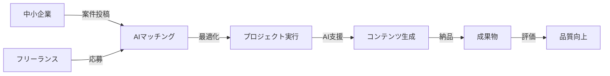

### ビジョン
「AIの力で中小企業のマーケティングを民主化し、優秀なフリーランスとの最適なマッチングを実現する」

### ミッション
- 🎯 中小企業の限られたマーケティング予算を最大化
- 🤝 フリーランスの専門スキルとAI技術の融合
- ⚡ 高品質なマーケティングコンテンツの効率的な制作

## 2. 市場分析

### 市場規模

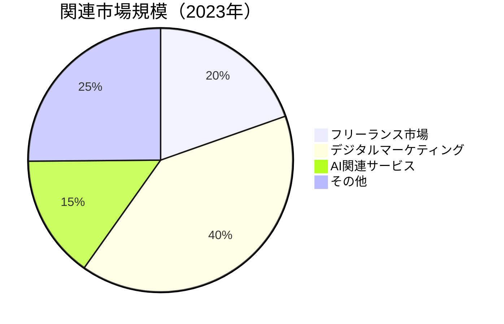

- **国内フリーランス市場**: 約1.56兆円（2023年）
- **デジタルマーケティング市場**: 約3.2兆円（2023年）
- **AI関連サービス市場**: 約1,200億円（2023年）

### ターゲット市場


- **一次ターゲット**: 従業員数10-100名の中小企業 👥
- **二次ターゲット**: マーケティング専門フリーランス 💼
- **市場セグメント**: BtoB、BtoC両方の中小企業 🏢

### 競合分析

| 競合サービス | 強み | 弱み | 差別化ポイント |
|-------------|------|------|---------------|
| ランサーズ | 大規模ユーザーベース | AI統合なし | ✅ AI統合 |
| クラウドワークス | 豊富な案件数 | マーケティング特化なし | ✅ マーケティング特化 |
| ココナラ | 個人向けサービス | 企業向け機能不足 | ✅ 企業向け機能 |

### 市場機会

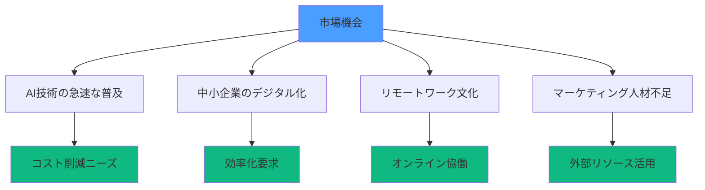

## 3. サービス概要

### 核心価値提案


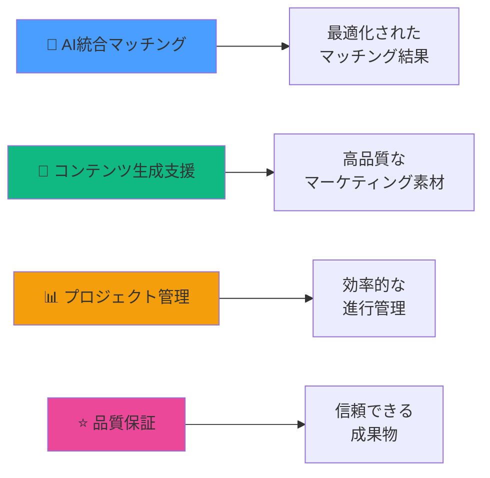

### 主要機能

#### 🏢 企業向け機能


- **📝 プロジェクト投稿**: 詳細な要件定義と予算設定
- **🔍 フリーランス検索**: スキル・実績・評価による絞り込み
- **🤖 AI支援ツール**: コンテンツ生成・編集支援
- **📈 進捗管理**: リアルタイムプロジェクト追跡
- **💳 決済管理**: 安全な支払いシステム

#### 👨‍💻 フリーランス向け機能


- **🎯 案件検索**: 条件に合った案件の自動推薦
- **💼 ポートフォリオ管理**: 実績・スキルの可視化
- **⚡ AI協働ツール**: 作業効率化支援
- **💰 収益管理**: 売上・税務サポート
- **📚 スキルアップ**: 学習リソース提供

#### 🤖 AI統合機能

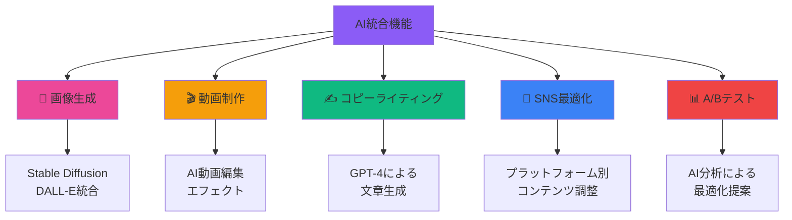

## 4. ビジネスモデル

### 収益構造

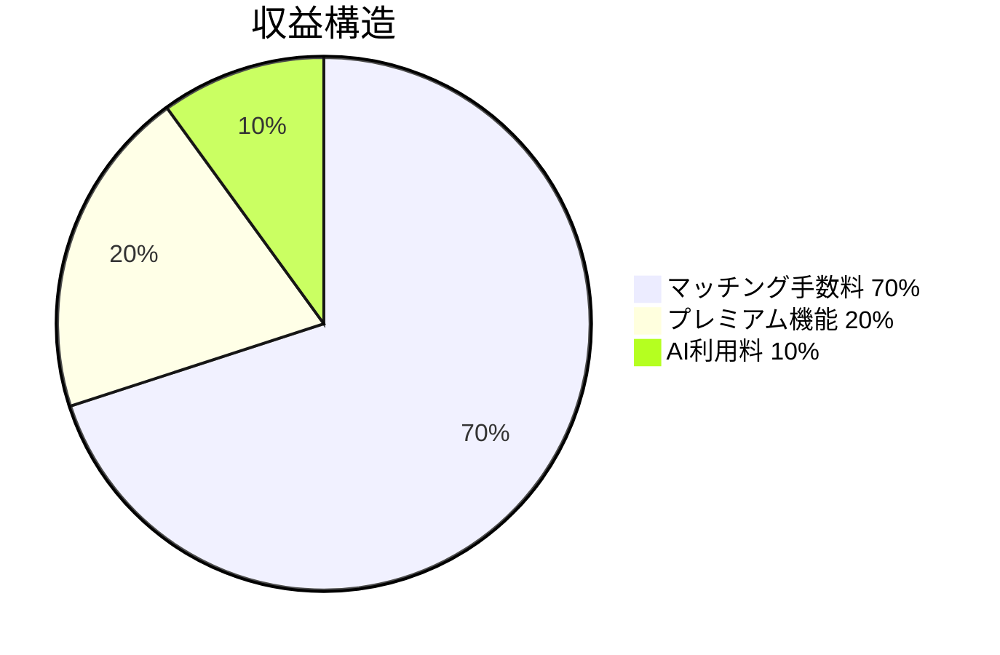

| 収益源 | 割合 | 説明 | 月間目標 |
|--------|------|------|----------|
| 💰 マッチング手数料 | 70% | 成約時に取引金額の10-15% | 700万円 |
| ⭐ プレミアム機能 | 20% | 月額サブスクリプション | 200万円 |
| 🤖 AI利用料 | 10% | 従量課金制 | 100万円 |

### 価格戦略


- **🆓 基本利用**: 無料（制限あり）
- **🏢 プレミアム企業**: 月額29,800円
- **👨‍💻 プレミアムフリーランス**: 月額9,800円
- **🤖 AI利用料**: 1回あたり100-500円

### 成長戦略

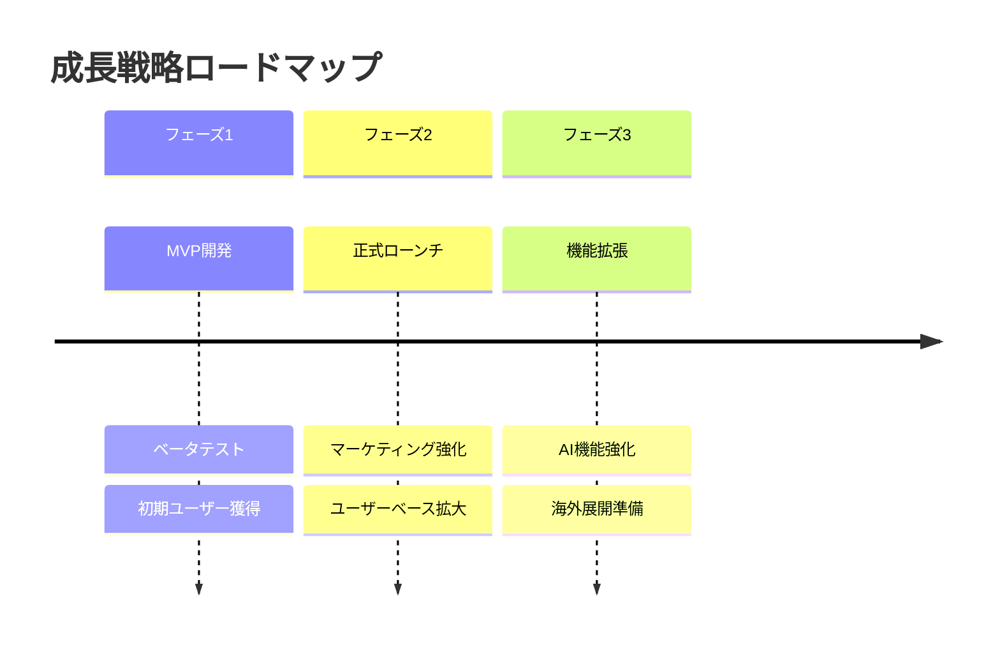

## 5. 技術アーキテクチャ

### システム構成

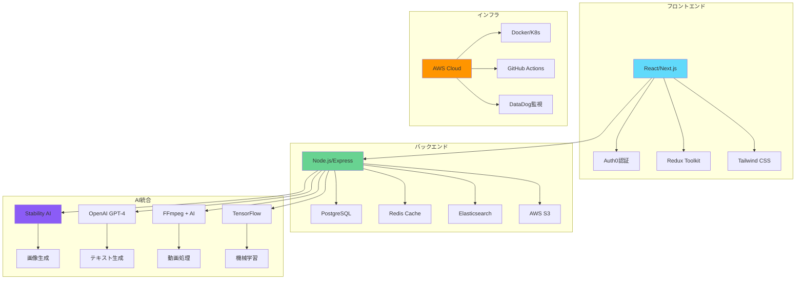


### セキュリティ

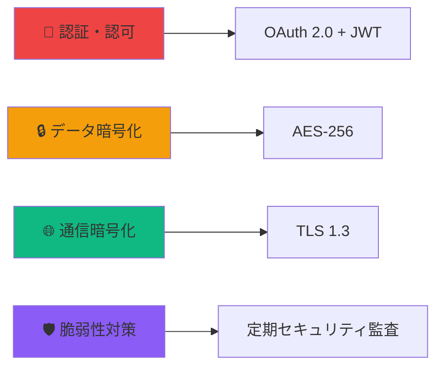

### スケーラビリティ


- **⚡ 水平スケーリング**: Kubernetes Auto Scaling
- **🗄️ データベース**: Read Replica + Sharding
- **🌐 CDN**: CloudFront
- **⚖️ ロードバランサー**: Application Load Balancer

## 6. 開発計画

### 開発ロードマップ

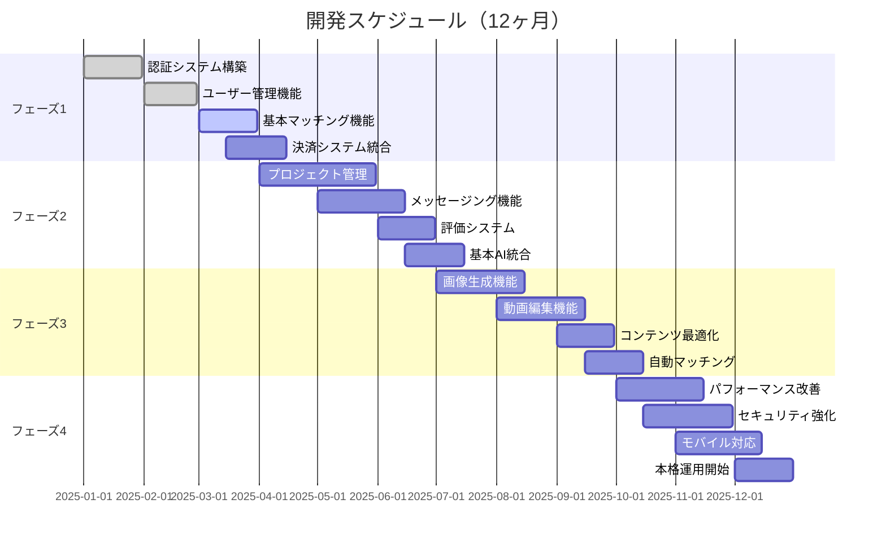

### マイルストーン


| フェーズ | 期間 | 主要成果物 | 成功指標 |
|---------|------|-----------|----------|
| 🏗️ **フェーズ1** | 3ヶ月 | MVP基盤 | ユーザー登録100名 |
| ⚙️ **フェーズ2** | 3ヶ月 | コア機能 | 初回マッチング成立 |
| 🤖 **フェーズ3** | 3ヶ月 | AI統合 | AI機能利用率30% |
| 🚀 **フェーズ4** | 3ヶ月 | 本格運用 | 月間GMV 1,000万円 |

## 7. チーム構成

### 必要な人材

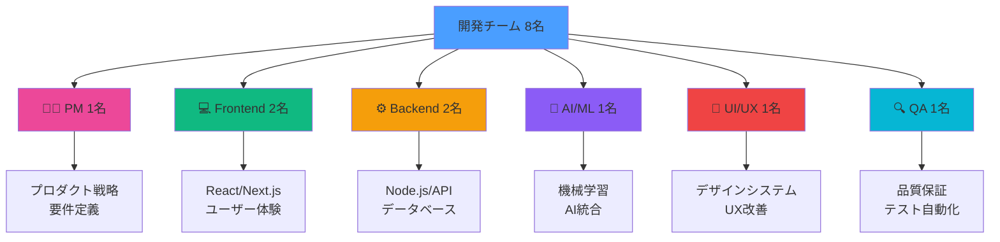


### 開発体制

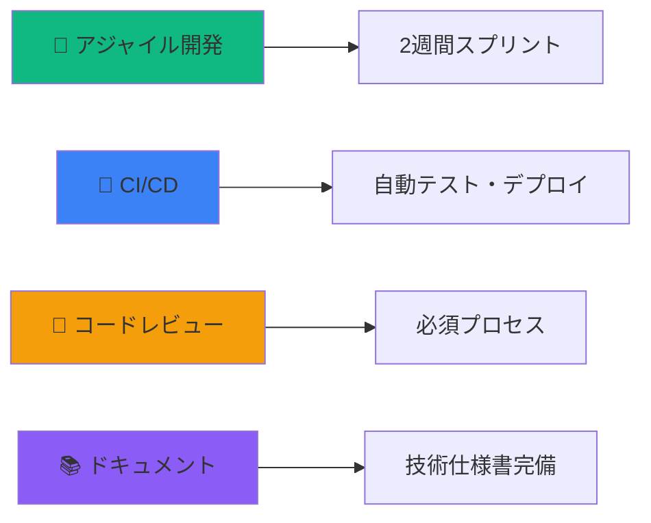

## 8. リスク分析

### 技術的リスク
- **AI API制限**: 代替プロバイダー確保
- **スケーラビリティ**: クラウドネイティブ設計
- **セキュリティ**: 定期的監査実施

### ビジネスリスク
- **競合参入**: 差別化機能の継続開発
- **法規制**: コンプライアンス体制構築
- **市場変化**: 柔軟な戦略調整

### 対策
- **技術**: マイクロサービス化、冗長化
- **ビジネス**: 多角化、パートナーシップ
- **運用**: 24/7監視、バックアップ体制

## 9. 予算・資金計画

### 開発費用（12ヶ月）

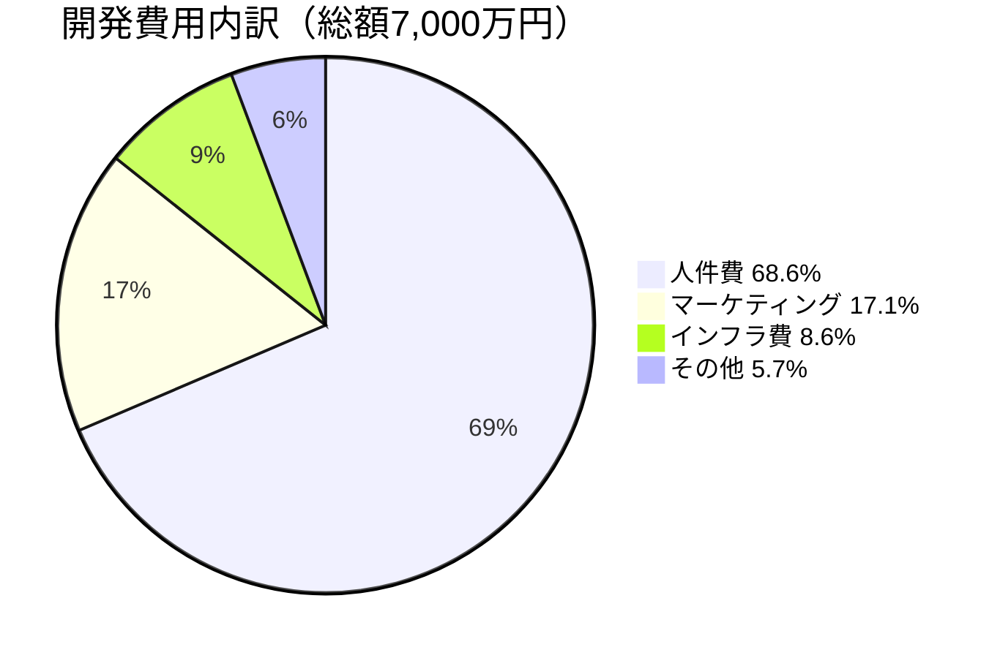

| 項目 | 金額 | 備考 | 割合 |
|------|------|------|------|
| 💼 人件費 | 4,800万円 | 8名×12ヶ月 | 68.6% |
| ☁️ インフラ費 | 600万円 | AWS、外部API | 8.6% |
| 📢 マーケティング | 1,200万円 | 広告、PR | 17.1% |
| 📋 その他 | 400万円 | 法務、会計等 | 5.7% |
| **💰 合計** | **7,000万円** | | **100%** |

### 収益予測（3年）

```mermaid
xychart-beta
    title "3年間収益予測"
    x-axis [1年目, 2年目, 3年目]
    y-axis "金額（万円)" -7000 --> 8000
    bar [500, 3000, 8000]
    bar [-6500, -2000, 1000]
```


- **📈 1年目**: 売上500万円、損失6,500万円
- **📊 2年目**: 売上3,000万円、損失2,000万円  
- **🎯 3年目**: 売上8,000万円、利益1,000万円

## 10. 成功指標（KPI）

### KPIダッシュボード

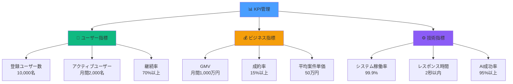

### 📈 ユーザー指標


- **👤 登録ユーザー数**: 10,000名（1年目）
- **🔥 アクティブユーザー**: 月間2,000名
- **💪 ユーザー継続率**: 70%以上

### 💰 ビジネス指標


- **💎 GMV**: 月間1,000万円（1年目）
- **🎯 取引成約率**: 15%以上
- **💵 平均案件単価**: 50万円

### ⚙️ 技術指標


- **🚀 システム稼働率**: 99.9%
- **⚡ レスポンス時間**: 2秒以内
- **🤖 AI生成成功率**: 95%以上

## 11. 次のステップ

### 即座に実行すべきアクション
1. **技術検証**: AI API統合テスト
2. **市場調査**: ターゲット企業ヒアリング
3. **プロトタイプ**: MVP開発開始
4. **チーム構築**: 核となる開発者採用

### 3ヶ月以内の目標
- [ ] 技術スタック確定
- [ ] 開発チーム完成
- [ ] MVP完成・テスト開始
- [ ] 初期ユーザー獲得開始

---

**作成日**: 2025年9月15日  
**バージョン**: 1.0  
**次回更新**: 2025年10月15日
