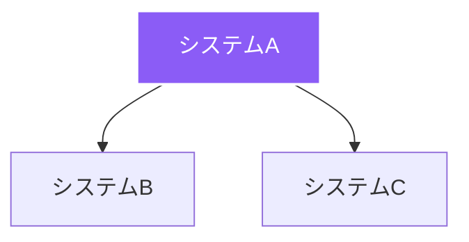
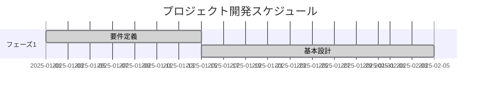

# 要件定義書作成ガイド

このドキュメントは、kamuiosプロジェクト内で要件定義書を作成するための手順をまとめたものです。

## 📁 ディレクトリ構成

```
data/
  sections.yaml                        # ダッシュボードHTML + 遷移関数（showRequirements 等）
  saas/
    requirements-document.yaml         # 2-1 要件定義書（KAMUI CODE）
    requirements-kamui-os.yaml         # KAMUI OS 要件定義書
    requirements-*.yaml                # その他の要件定義書

themes/kamui-docs/
  layouts/
    index.html                         # セクション合成と「カード→本文」切替
    partials/requirements-document.html# 要件定義書の共通テンプレート
  static/
    js/main.js                         # 目次生成（2-1配下に 2-1-1/2-1-2 を追加）
    css/main.css                       # 共通スタイル

static/
  images/                              # カード画像等（requirements_doc_card.png ほか）
  data/prompts/                        # 本ページのプロンプトMarkdown置き場
```

## 🔧 新しい要件定義書作成手順

### 1. YAMLファイル作成
- `data/saas/requirements-<プロジェクト名>.yaml` を作成
- 既存のYAMLファイルをコピーして `id`, `title`, `tabs` を調整

### 2. 基本構造の定義
```yaml
- id: requirements-<プロジェクト名>
  category: 2
  category_name: 要件定義・開発
  title: プロジェクト名 要件定義書
  content: |
    プロジェクトの概要説明
  
  # メインビジュアル
  image: /images/project-image.png
  
  # タブナビゲーション
  tabs:
    - id: overview
      label: 概要
      icon: 📋
      active: true
    - id: users
      label: ユーザー分析
      icon: 👥
    - id: requirements
      label: 要件定義
      icon: 📝
    - id: architecture
      label: アーキテクチャ
      icon: 🏗️
    - id: implementation
      label: 実装
      icon: 💻
    - id: operations
      label: 運用
      icon: ⚙️
```

### 3. 必須構成要素

#### 概要カード (`overview_cards`)
```yaml
overview_cards:
  - title: プロジェクト概要
    icon: 📋
    content: |
      プロジェクトの目的と概要を記述
  
  - title: 対象領域
    icon: 🎯
    content: |
      - **領域1**: 説明
      - **領域2**: 説明
  
  - title: 主要機能
    icon: ⚡
    content: |
      - 機能1
      - 機能2
      - 機能3
```

#### 機能要件 (`functional_requirements`)
```yaml
functional_requirements:
  - id: FR-001
    name: 機能名
    description: 機能の詳細説明
    priority: 必須
  - id: FR-002
    name: 機能名2
    description: 機能の詳細説明2
    priority: 推奨
```

#### 非機能要件 (`non_functional_requirements`)
```yaml
non_functional_requirements:
  - category: パフォーマンス
    requirements:
      - レスポンスタイム要件
      - スループット要件
  - category: 可用性
    requirements:
      - アップタイム要件
      - 復旧時間要件
  - category: セキュリティ
    requirements:
      - 認証要件
      - 暗号化要件
```

#### 技術スタック (`tech_stack`)
```yaml
tech_stack:
  frontend:
    - name: React
      version: "18.x"
      purpose: UIフレームワーク
  backend:
    - name: Node.js
      version: "20.x"
      purpose: サーバーランタイム
```

#### ユーザーペルソナ (`user_personas`)
```yaml
user_personas:
  - name: ユーザー名
    age: 年齢
    role: 役職
    icon: 👨‍💻
    goals:
      - 目標1
      - 目標2
    pain_points:
      - 課題1
      - 課題2
    needs:
      - ニーズ1
      - ニーズ2
```

#### アーキテクチャ図 (`mermaid`)
```yaml
mermaid: |
  graph TD
    A[システムA] --> B[システムB]
    A --> C[システムC]
    
    style A fill:#8B5CF6,stroke:#fff,stroke-width:2px,color:#fff
```

**Windsurfプレビュー用のマーメイド図例:**


#### ガントチャート (`gantt`)
```yaml
gantt: |
  gantt
    title プロジェクト開発スケジュール
    dateFormat YYYY-MM-DD
    section フェーズ1
    要件定義 :done, req, 2025-01-01, 14d
    基本設計 :done, design, after req, 21d
```

**Windsurfプレビュー用のガントチャート例:**


### 4. 画像とリソース配置
- 画像は `static/images/` に配置
- YAMLの `image:` にパスを設定
- 動画がある場合は `video:` にパスを設定

### 5. ナビゲーション登録
- `themes/kamui-docs/layouts/index.html` の requirements-document ブロックにカードを追加
- 必要に応じて `main.js` のサブ項目配列に追加

## 📋 標準的な要件定義書構造

1. **プロジェクト概要**
   - 目的・背景
   - 対象領域
   - 主要機能

2. **ユーザー分析**
   - ペルソナ定義
   - カスタマージャーニーマップ
   - ユーザーの声

3. **要件定義**
   - 機能要件
   - 非機能要件
   - 受入基準

4. **アーキテクチャ**
   - システム構成図
   - API設計
   - データフロー

5. **実装**
   - 技術スタック
   - 開発計画
   - 実装例

6. **運用**
   - 監視・保守
   - セキュリティ
   - インシデント対応

## 🎯 受け入れ基準

- 2-1の下に新規要件書のタイトルが `2-1-N` として表示される
- クリックで本文が直接開く
- 直リンク `#requirements-<プロジェクト名>` で本文に到達できる
- ダッシュボードのカード導線が正しく遷移する

## 🔍 トラブルシューティング

### YAML文法エラー
- バッククォートやコロンを含む場合は値をダブルクォートで囲む
- インデントは半角スペース2文字で統一

### 目次の重複
- `main.js` の並べ替え時に重複除外済み
- 新規子追加時はIDの重複に注意

### 直リンクで本文が開かない
- `requirementsDocCard-<sectionId>` と `requirementsDocBody-<sectionId>` のID整合を確認

## 📝 テスト手順

1. `hugo server -D` でローカルサーバーを起動
2. `#requirements-<プロジェクト名>` にアクセスして表示確認
3. タブ切り替えの動作確認
4. 目次からの遷移確認

## 🔄 更新・メンテナンス

- 既存要件書の編集: 対応するYAMLファイルを直接編集
- カード表示の調整: `themes/kamui-docs/layouts/index.html`
- TOCの並び調整: `themes/kamui-docs/static/js/main.js`

---

このガイドに従って要件定義書を作成することで、統一された品質とフォーマットの要件定義書を効率的に作成できます。
